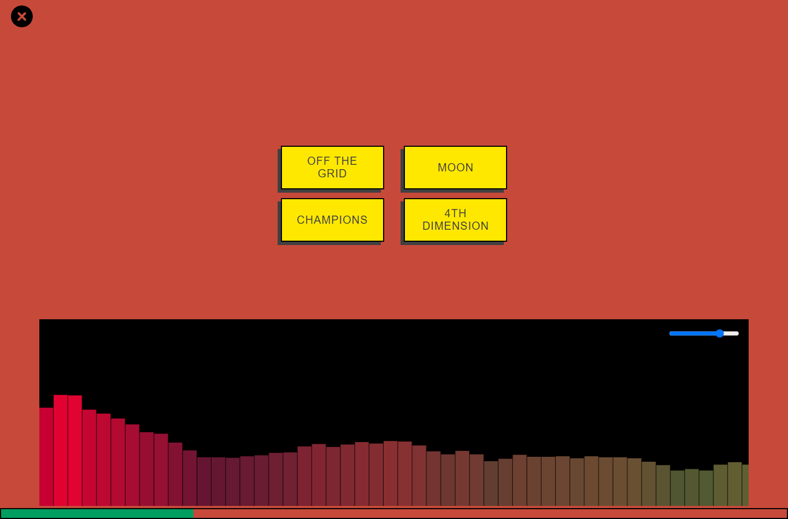

# Track Trivia: [Live link here](https://track-trivia.vercel.app/)

Track trivia is a music guessing game inspired from a viral tiktok trend with a simple concept. Name a song from just the intro to prove your musical knowledge.

## How it works:

Pick an artist, listen to the first 10 seconds of a song, if you guess it correctly you get a point!

## Technologies Used

- NextJS (React) - NextJS provies superior functionality over Create React App out of the box. I utilized NextJS' File-system Routing, Built-in CSS modules, Middleware for Routing, Typescript Support, and Fast Refresh

- Typescript - Used for strong static typing, and compilation time errors

- Redux - Global State Management library to store Spotify Temporal Token, track data called from spotify, and Volume levels

- Supabase - For this project I needed a backend with a database and file storage for MP3s. Supabase is an open source Firebase alternative with flexible features that contained all functionality needed

- SQL - Used to create tables and modify permissions

- Spotify API - Used to collect and store song data

- HTML Cavnas - Audio Visualization

### Features

- Shows High Scores and games played
- Audio Visualization with HTML Canvas
- Share buttons
- Spotify links integrated

Features I would like to add

- Add Popular Genres and Artists

## To Run Locally:

clone the respository
` git clone https://github.com/datamosh0/track-trivia.git`

run from the project file to install dependencies
` npm install`

start dev server and navigate to http://localhost:3000/
`npm run dev`
